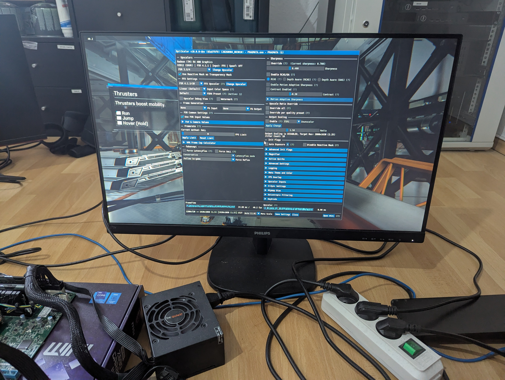

# FSR4 INT8 on Polaris (gfx803)

Run AMD's FSR4 upscaler on GCN4 cards, such as the RX 470, RX 480, RX 570 and RX 580, and make it
fast enough to use.

Three pieces do the work.

1. **A patched RADV.** GCN4 has no hardware `dp4a`, so every int8 multiply-accumulate in FSR4's
   network is emulated. Stock Mesa uses full 32-bit multiplies. The patch emits `v_mad_i32_i24`
   instead, a full-rate 24-bit multiply-add that GCN has had since its first generation, and it is
   exact for 8-bit operands. In Pragmata that alone makes frames 2.28 times faster than stock Mesa.
2. **A Vulkan layer.** It does two things. It rewrites FSR4's packed dot products into the plain
   32-bit multiplies the driver patch matches, on any card that has no hardware instruction for
   them. It also swaps FSR4's network shaders for tuned ones, in which the weights are constants and
   two output channels share one multiply through a quantized, packed operand. A shader the driver
   rejects falls back to the game's own.
3. **A choice of upscaler DLL.** `stock` is AMD's own. `bc250` is the `daniel-h-0/bc250-fsr4-fork`
   rebuild at `v4.0.0-rc10`, made to run on GCN4, whose shaders carry their weights as constants.
   `hybrid` is that rebuild with ten model passes handed back to AMD's shaders, so the tuned sets
   can replace them, and it is the fastest of the three. `FSR4_DLL` tells the launcher which one you
   installed, because the four tier names below map to a different shader set on each.
   `docs/DLLS.md` describes all three.

Together, on an RX 570 in Pragmata at 1280x720 upscaled to 1920x1080, the upscaler goes from 15.2 ms
to 9.1 ms at the `balanced` tier and 7.5 ms at `speed`, and the frame goes from 17.4 ms to 11.1 ms
and 9.6 ms. Keeping the result exact costs 12.6 ms of upscaler time, which is the floor: the hot
shaders already run at 0.95 to 0.98 instructions per multiply, so going lower means doing less
arithmetic rather than doing it better. A Vega 56 gains far more, from 7.5 ms to about 3 ms.

Nothing else is patched. Your normal Proton and vkd3d-proton are used as they are.

Nothing is installed system-wide. The driver is a second copy of RADV that one game opts into
through an environment variable, and the layer is enabled per game in the same way.

---

## Quick start

Install the driver as described below, then put the launcher in front of the game.

**Steam.** In the game's launch options:

```
FSR4_DLL=stock FSR4_SET=balanced PROTON_FSR4_UPGRADE=0 \
    /path/to/tools/fsr4_layer/fsr4-run %command%
```

**Heroic.** Settings, Advanced, Wrapper command:

```
/path/to/tools/fsr4_layer/fsr4-run
```

and add `FSR4_DLL`, `FSR4_SET=balanced` and `PROTON_FSR4_UPGRADE=0` to the environment variables in
the same panel. Without `PROTON_FSR4_UPGRADE=0` Proton replaces the FSR4 DLL on every launch and
undoes whichever one you installed.

**Anything else.** Put `fsr4-run` in front of the command.

Build the layer once before first use:

```bash
cd tools/fsr4_layer
gcc -O2 -fPIC -shared -o libfsr4_layer.so fsr4_layer.c -lpthread
```

### The tiers

`FSR4_SET` picks how far the shaders are rewritten. Four names cover the common cases. Each DLL maps
them to its own best set, because the fastest set is not the same on all three, so `FSR4_DLL` decides
what a tier means. The tables are `aliases.stock`, `aliases.bc250` and `aliases.hybrid` next to the
sets, and `FSR4_SET=list` prints the one for the DLL you named.

| name | what it does | how it looks |
|---|---|---|
| `lossless` | the same maths, with the weights baked in | bit-identical to stock |
| `quality` | per-pass mix, every pass held under 15 percent error | hard to tell from stock |
| `balanced` | per-pass mix, under 25 percent | very close to stock |
| `speed` | drops every weight of magnitude 16 or less | visibly softer, fastest |
| `off` | replace no shader, but still rewrite the dot products | stock FSR4, faster on GCN4 |
| `none` | do not load the layer at all | stock FSR4 |

On the `stock` and `hybrid` DLLs, `balanced` and `quality` also carry a pass9 shader that the plain
sets have none of. It is worth 0.11 to 0.19 ms, its speed is measured and its picture is not, so
look at it before you trust it. `docs/SETS.md` says why.

Twenty-two sets ship in total, one per variant we measured, and any of them can be named directly.
`FSR4_SET=list` prints them, and `docs/SETS.md` says what each one is, what it measured on two cards,
and how it looked.

Other variables: `FSR4_DEBUG=1` prints one line per replaced shader, `FSR4_SETS` points at another
directory of sets, and `FSR4_CACHE` moves the cache.

A set holds SPIR-V that replaces what vkd3d-proton compiled, so the layer has to recognise the build
you run. Two Proton builds are covered out of the box. On a third the layer replaces nothing, which
is harmless and leaves you with `off` behaviour, and `tools/fsr4_tune/make_keys.py` teaches the
shipped sets that build in one step. `tools/fsr4_tune/` rebuilds the sets from scratch for your card.

---

## What you need

Two parts, and your normal Proton.

| part | what it does | where |
|---|---|---|
| Mesa / RADV | NIR rules that emit `v_mad_i32_i24`, so an int8 multiply-add costs one instruction | `patches/mesa-26.2.2-nir-imul24-int8.patch`, prebuilt in `radv/` |
| Vulkan layer | rewrites the packed dot products, and swaps FSR4's network shaders for tuned ones | `tools/fsr4_layer/` |

The driver patch is the one that makes FSR4 usable at all on GCN4. The layer is what turns FSR4's
multiplies into the form the driver patch matches, so the two belong together: the driver patch alone
leaves most of the gain on the table.

Use `patches/mesa-26.2.2-nir-imul24-int8.patch` for Mesa 26.2.2. `patches/mesa-nir-imul24-int8.patch`
is the original against 26.1.6. It also applies to 26.2.2, but with line offsets.

Prebuilt copies of everything, with checksums, are listed in `CHECKSUMS.md`.

---

## Prebuilt binaries

If you would rather not build anything, the
[latest release](https://github.com/Schaka/fsr4-gfx803/releases/latest) has the patched RADV, the
Vulkan layer and every shader set attached, with an `install.sh`. The numbered steps below still
describe what that script leaves to you.

---

## 1. Build the driver

Build this on a reasonably fast machine. It takes a while on an older CPU.

```bash
git clone https://gitlab.freedesktop.org/mesa/mesa.git
cd mesa
git fetch --depth=1 origin 26.2
git checkout -b fsr4 FETCH_HEAD
git apply /path/to/patches/mesa-26.2.2-nir-imul24-int8.patch

meson setup build \
  -Dvulkan-drivers=amd -Dgallium-drivers= -Dplatforms=wayland,x11 \
  -Dllvm=disabled -Dvideo-codecs= -Dbuildtype=release -Db_ndebug=true
ninja -C build
```

`-Dllvm=disabled` is deliberate. RADV uses its own compiler, ACO, so the library then links no LLVM
at all and will run on a machine whose LLVM version differs from the build machine's. Check it:

```bash
ldd build/src/amd/vulkan/libvulkan_radeon.so | grep -i llvm    # must print nothing
```

Install it somewhere of its own. Do not overwrite the system Mesa.

```bash
mkdir -p ~/.local/share/radv-fsr4
cp build/src/amd/vulkan/libvulkan_radeon.so ~/.local/share/radv-fsr4/
sed "s|\"library_path\":.*|\"library_path\": \"$HOME/.local/share/radv-fsr4/libvulkan_radeon.so\",|" \
  build/src/amd/vulkan/radeon_icd.x86_64.json > ~/.local/share/radv-fsr4/radeon_icd.x86_64.json
```

Nothing uses this driver unless `VK_DRIVER_FILES` points at it.

---

## 2. Enable fp16

FSR4's shaders need the Vulkan feature `shaderFloat16`. RADV turns it off by default on GFX8,
because GCN4 has no double-rate fp16. Turn it on by copying `drirc.d/99-fsr4-gfx803.conf` to
`~/.drirc`.

Check it:

```bash
vulkaninfo | grep shaderFloat16      # must say true, with no variables set
```

If this is wrong, FSR4's compute pipelines fail to build and the upscaler silently does nothing.

---

## 3. Build the Vulkan layer

```bash
cd tools/fsr4_layer
gcc -O2 -fPIC -shared -o libfsr4_layer.so fsr4_layer.c -lpthread
```

That is all it needs. `fsr4-run` finds the layer and the sets next to itself.

---

## 4. Set up OptiScaler

Install OptiScaler 0.9.4 into the game directory, with an FSR4 4.1.1 upscaler DLL. The stock 4.1.1
DLL and the 4.1.1b INT8 build both work, and both are in `fsr4_dlls/`.

In `OptiScaler.ini`:

```
Dx12Upscaler=fsr31
UpscalerIndex=0
Fsr4Update=true
Fsr4ForceEnableInt8=true
```

---

## 5. Launch

```bash
VK_DRIVER_FILES=$HOME/.local/share/radv-fsr4/radeon_icd.x86_64.json \
FSR4_SET=balanced /path/to/tools/fsr4_layer/fsr4-run \
  %command%
```

Set `FSR4_SET=none` to run stock FSR4 on the patched driver with the layer out of the way. That is
much slower, because the layer is what feeds the driver patch.

If your machine has more than one AMD GPU, add `MESA_VK_DEVICE_SELECT=<vendor>:<device>` so the
right one is used. Find the IDs with `lspci -nn | grep VGA`.


---

## How the dot product reaches the driver patch

FSR4 drives every multiply-accumulate through DXIL's `dot4add_i8packed`. vkd3d-proton turns that into
one SPIR-V `OpSDot`, the packed 4x8 integer dot product, and GCN4 has no instruction for it, so the
driver lowers it in software. That lowering never produces the pattern the Mesa patch matches.

The layer rewrites each `OpSDot` into four sign-extending byte extracts, four multiplies and three
adds, all in 32 bits. The rewrite is exact, because a signed 4x8 dot product is nothing but the sum
of the four signed byte products. NIR then proves the operands fit in 24 bits and ACO fuses each
multiply into one `v_mad_i32_i24`, which is the whole point of the driver patch.

The layer asks the device whether it accelerates the packed signed dot product, and only rewrites
when the answer is no, so the same layer is a no-op on a card that has `dp4a`. `FSR4_NO_SDOT_EXPAND=1`
turns the rewrite off. In Pragmata on an RX 570, with the patched driver in both cases, the rewrite
alone takes whole frames from 25.99 ms to 23.50 ms.

## Did it work?

Check OptiScaler's log. A correct run shows `FSR31FeatureDx12` together with `FSR4ModelSelection`.
Turn on `Fsr4EnableWatermark=true` in `OptiScaler.ini` to see the FSR4 version on screen.

If you see `FSR2FeatureDx12_212`, FSR4 is not running at all. OptiScaler has quietly fallen back to
its own built-in FSR 2.1.2 copy, and any frametime you measure is meaningless.

`FSR4_DEBUG=1` makes the layer print one line per shader. Count the lines saying `replaced`: the
stock DLL with a tier replaces about eleven, the hybrid about ten, and `bc250` exactly one on any
tier but `lossless`. `FSR4_PROFILE=1` reports the GPU time the network costs and the dispatch rate.
FSR4 runs a few dozen network dispatches per frame, so a build that runs a handful is not upscaling,
whatever its frame rate says.

---

## What each DLL and tier costs

RX 570, Pragmata, 1280x720 upscaled to 1920x1080, FSR 4.1.1b, one scene, ten configurations measured
one after another and then again in a single batch, so the rows compare.

| DLL | tier | frametime ms | fps | upscaler ms |
|---|---|---:|---:|---:|
| `stock` | none | 17.41 | 57.5 | 15.23 |
| `stock` | `lossless` | 17.01 | 58.8 | 14.86 |
| `stock` | `quality` | 14.78 | 67.7 | 12.73 |
| `stock` | `balanced` | 13.07 | 76.5 | 11.09 |
| `stock` | `speed` | 10.89 | 91.8 | 8.99 |
| `bc250` | `lossless` | 15.04 | 66.5 | 12.84 |
| `hybrid` | `lossless` | 14.84 | 67.4 | 12.56 |
| `hybrid` | `quality` | 12.88 | 77.7 | 10.83 |
| `hybrid` | `balanced` | 11.31 | 88.4 | 9.14 |
| `hybrid` | `speed` | 9.62 | 104.0 | 7.53 |

The `balanced` rows use `fin25`. Both DLLs ship `fin25_pack39` for that tier, which is `fin25` with
a pass9 shader added, and that is a further 0.17 to 0.19 ms. Side by side, plain `fin25` is slightly
the cleaner of the two, so name it directly if you would rather have the picture than the 0.19 ms.

Running the whole table again with the GPU timestamps off moved no frametime by more than 0.05 ms,
so the cost of measuring is not in these numbers. `docs/DLLS.md` describes the three DLLs, and
`FSR4_PROFILE=1` reproduces the upscaler column on your own card.

Against a control that loads the layer and changes nothing (`FSR4_SET=off FSR4_NO_SDOT_EXPAND=1`,
18.93 ms on an earlier batch), the dot product rewrite alone takes about 4 ms off the upscaler
without touching the picture.

Three earlier findings sit under all of the above. The driver patch is what makes FSR4 usable at
all: on an RX 470 it takes 4.1.1 from 63.35 ms per frame to 27.78 ms, a factor of 2.28. Start from
FSR 4.1.1 rather than 4.0.2, which is 2.6 ms per frame slower. And upgrading Mesa on its own gains
nothing: stock Mesa 26.2.2 already carries upstream merge request 41178, which applies the same
24-bit idea to NIR's software `sdot_4x8` lowering, and letting Mesa lower those 4,264 `OpSDot`
instructions costs 2.5 ms per frame more than the layer rewriting them itself. The logs are in
`evidence/fsr-4.0.2-vs-4.1.1/` and `evidence/mesa-26.2.2-vs-our-patch/`.

A Vega 56 gains far more: there the upscaler goes from 7.5 ms to about 3 ms. Polaris already runs
FSR4's own code at one vector instruction per multiply, because it extracts weight bytes on the
scalar unit, so there is less to win. The Vega also rewards weight baking on its own, while on
Polaris baking alone is close to a wash. `docs/SETS.md` has the frametimes and every other set.

Two findings are worth knowing before you pick a set.

1. **Leave the output head alone.** Rewriting it costs temporal stability, whatever the method. The
   head writes the history buffer that the next frame reads, so an error there returns frame after
   frame. None of the shipped sets touches it.
2. **At equal measured error, pruning looks worse than quantization.** Pruning removes a share of
   every sum, which biases the result, while quantization spreads a small unbiased error over every
   term. Prefer the packed sets when the two are close.

`notes/FSR4_411_ANALYSIS.md` has the per-pass measurements behind all of this.

---

## Rebuilding the sets for your card

The best variant differs per card: on the Vega, 5-bit packing wins on pass9, and on Polaris FSR4's
own shader wins there. `tools/fsr4_tune/` rebuilds and re-times everything on the card it runs on.
See its README. The short version:

Run the game once with `FSR4_LAYER_DUMP=/tmp/fsr4dump` to collect the shaders it really compiles,
then:

```bash
cd tools/fsr4_tune
python3 tune.py capture /tmp/fsr4dump weights.bin
python3 tune.py generate --modes pack6,pack5,pack4,prune16
python3 tune.py bench /tmp/fsr4dump
python3 tune.py install ~/.local/share/fsr4/sets/mine --mode best
```

Then run with `FSR4_SET=mine`. The layer names every dumped shader after the SPIR-V it saw and looks
a replacement up under that same name, so a set built this way needs no translation table and is
valid for exactly the Proton build you dumped it from.



The photo shows the BC-250 fork's FSR 4.1.1 build running in Pragmata on an RX 580, in September
2026. The overlay reports 1280x720 upscaled to 1920x1080 and 8.90 ms of upscaler time. It names the
card as an RX 480, because the RX 580 is the same Polaris 10 chip under the same device ID. The
frametime in the corner is measured with the overlay open, which costs a good deal on its own, so
it is not a benchmark.

---

## Repository layout

| path | what |
|---|---|
| `patches/` | the Mesa patch |
| `radv/` | the three prebuilt RADV drivers, with an install script |
| `drirc.d/` | the `~/.drirc` file that turns on fp16 |
| `fsr4_dlls/` | every FSR4 upscaler DLL tested, with where each came from |
| `pragmata_working_set/` | the OptiScaler configuration and file list for Pragmata |
| `sdk_sample/`, `testkit/` | AMD's FSR sample executable, and the deployment used to benchmark it |
| `proxies/` | the frame-generation passthrough proxy the SDK sample uses |
| `evidence/` | logs backing the results above |
| `tools/fsr4_layer/` | the Vulkan layer, its launcher, and every shader set |
| `tools/fsr4_tune/` | the tuner that builds and scores the sets |
| `tools/bc250/` | the scripts that rebuild the BC-250 fork's DLL for GCN4, and how to redo it |
| `tools/bench/` | the measurement harness behind every number here |
| `tools/` | the benchmark and release scripts |
| `docs/DLLS.md` | the three upscaler DLLs and when to use each |
| `docs/SETS.md` | every shader set, what it measured, and how it looked |
| `REPRODUCE.md` | how to reproduce the measurement exactly |
| `notes/` | how the game benchmark runs headless |
| `data/` | captured SPIR-V, ISA, weights, activations, roofline analysis |

`REPRODUCE.md`, `notes/` and `tools/` describe one specific test machine, with its own paths and
hardware. They are a record of how the result was produced, not instructions for your machine.
`data/roofline.md` covers what is and is not reachable on this hardware.

Credentials are deliberately not recorded anywhere in this repository.

---

## Standing on other people's work

**[`daniel-h-0/bc250-fsr4-fork`](https://github.com/daniel-h-0/bc250-fsr4-fork)** is the reason two
of the three DLLs here exist. That project rebuilds AMD's FSR4 upscaler DLL with its shaders
rewritten by hand, so the weights arrive as constants in the code instead of being streamed from a
buffer. It targets the BC-250, a gfx1013 part, and none of it was written with Polaris in mind. It
turns out to be worth a great deal here anyway: its postpass alone is 1.5 ms of frametime on a
GCN4 card, and its pass6 and pass7 beat every shader this project tuned for those roles.

Two things about how that project is built mattered as much as the shaders. Its `build.py` refuses a
modified source on purpose, because it exists to prove the published DLL reproduces byte for byte
from the pinned SDK DLL and the pinned compiler. That is what made it possible to trust any change
made on top of it: a difference in a measurement could only be the change, never the toolchain. And
its `manifest.json` names every shader by role, which is what made the hybrid possible at all,
because a split between their shaders and ours needs a way to say which is which.

The hybrid in this repository is a derivation of their work, not a replacement for it. If you have a
BC-250, go and use theirs directly.

**[OptiScaler](https://github.com/cdozdil/OptiScaler)** is what gets FSR4 into a game that never
shipped with it, and the model selection hook it added is what lets an INT8 model be forced on a
card AMD does not target.

**Mesa and RADV.** The driver patch here is small. It sits on top of a compiler that already knew
how to do almost all of this, and upstream merge request 41178 had already applied the same 24-bit
idea to NIR's software dot product lowering before this project started.
